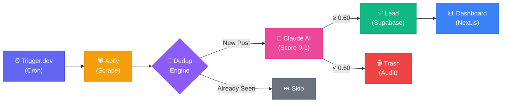
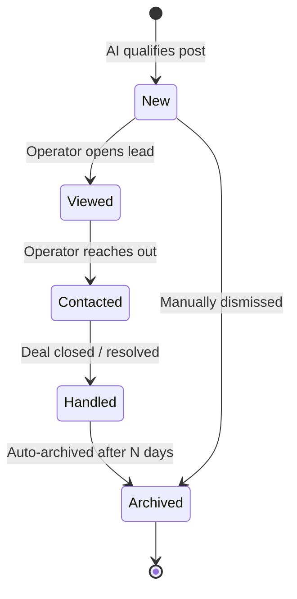
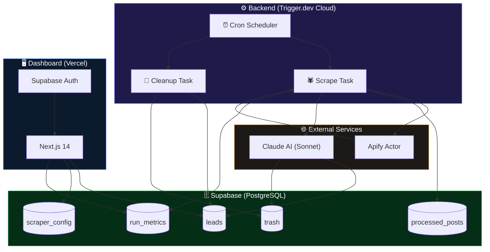
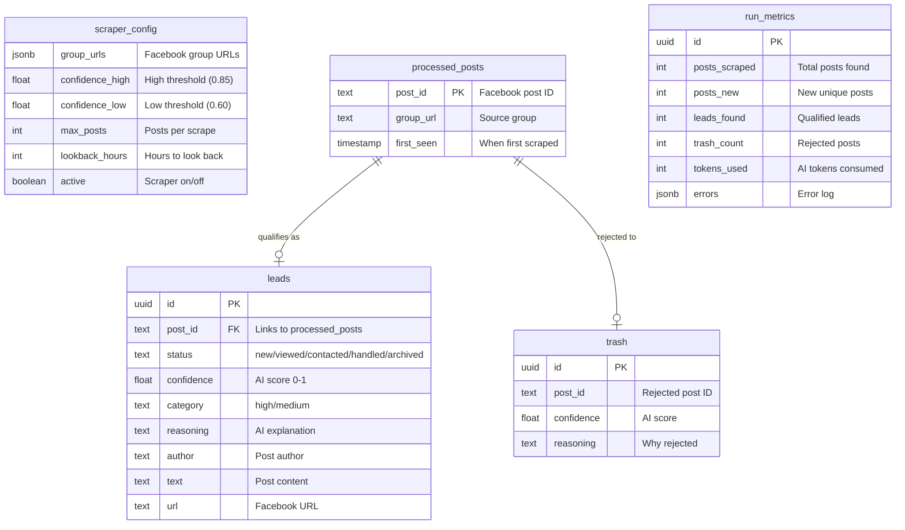

# Family Lawyer Lead Scraper

**Automated lead generation pipeline that scrapes Facebook groups, uses AI to qualify leads, and serves them through a real-time dashboard.**

Built for family law firms in Israel — scrapes Hebrew & English posts, scores relevance with Claude AI, and delivers qualified leads to a management dashboard.

   

---

## How It Works



1. **Trigger.dev** runs a scheduled cron job (configurable: hourly to daily)
2. **Apify** scrapes configured Facebook groups for new posts
3. **Deduplication engine** filters out already-processed posts
4. **Claude AI (Sonnet)** analyzes each post with a niche-specific prompt — scores relevance 0-1
5. **Supabase** stores qualified leads, trash (for auditing), and run metrics
6. **Dashboard** lets operators manage leads through a sales pipeline

## Key Features

### AI-Powered Lead Qualification
- Claude AI scores each post's likelihood of needing a family lawyer (0.0 - 1.0)
- Hebrew & English support — handles slang, abbreviations, and mixed-language posts
- Few-shot prompting with real examples for high accuracy
- Configurable confidence thresholds (high / medium / trash)
- Trash table preserved for auditing false negatives and tuning

### Lead Lifecycle



### Real-Time Dashboard
- **Leads view** — filterable by status, source group, and confidence score
- **Sales pipeline** — track leads through: New → Viewed → Contacted → Handled → Archived
- **Analytics** — 30-day charts for scrape volume, lead conversion, and AI token usage
- **Settings panel** — configure groups, schedule, AI thresholds, and data retention
- **Manual controls** — trigger runs on demand, cancel active runs
- Responsive design (table on desktop, cards on mobile)

### Production-Grade Pipeline
- Deduplication registry — never processes the same post twice
- Age filtering — rejects old posts resurfacing from new comments
- Active hours scheduling — run only during business hours
- Auto-archive handled leads after N days
- Auto-delete trash after N days
- Per-run metrics: posts scraped, leads found, tokens used, errors

## Tech Stack

| Layer | Technology |
|---|---|
| **Orchestration** | Trigger.dev v3 — cron scheduling, retry logic, 900s max duration |
| **Scraping** | Apify — `facebook-groups-scraper` actor |
| **AI** | Anthropic Claude Sonnet — structured JSON scoring with reasoning |
| **Database** | Supabase (PostgreSQL) — RLS-secured, indexed for dashboard queries |
| **Dashboard** | Next.js 14 (App Router) + Tailwind CSS + shadcn/ui + Recharts |
| **Auth** | Supabase Auth — session-based, SSR-compatible |
| **Deployment** | Vercel (dashboard) + Trigger.dev Cloud (backend) |

## Architecture



**Scheduled Tasks:**
- `family-lawyer-scrape` — main pipeline (configurable interval)
- `family-lawyer-cleanup` — archive old leads, purge trash (hourly)

## Database Schema



## Getting Started

### Prerequisites
- Node.js 20+
- Supabase project
- Apify account
- Anthropic API key
- Trigger.dev account

### Setup

```bash
# Clone and install
git clone https://github.com/Adir1123/family_lawyer_scraper.git
cd family-lawyer-scraper
npm install

# Configure environment
cp .env.example .env
# Fill in your API keys

# Apply database schema
# Run supabase/migrations/001_initial_schema.sql against your Supabase project

# Add Facebook group URLs to scraper_config table in Supabase

# Start development
npx trigger.dev dev        # Backend pipeline
cd dashboard && npm run dev # Dashboard at localhost:3000
```

### Environment Variables

| Variable | Description |
|---|---|
| `APIFY_TOKEN` | Apify API token |
| `ANTHROPIC_API_KEY` | Anthropic API key for Claude |
| `SUPABASE_URL` | Supabase project URL |
| `SUPABASE_SERVICE_KEY` | Supabase service role key |
| `TRIGGER_SECRET_KEY` | Trigger.dev secret key |

## Project Structure

```
family-lawyer-scraper/
├── backend/
│   ├── src/
│   │   ├── config/          # Niche-specific keywords & signals
│   │   ├── services/        # Apify, AI filter, Supabase clients
│   │   ├── trigger/         # Scheduled task definitions
│   │   ├── prompts/         # Claude system prompt
│   │   └── types/           # TypeScript interfaces
│   └── trigger.config.ts
├── dashboard/
│   ├── app/                 # Next.js App Router pages
│   ├── components/          # UI components (shadcn/ui)
│   └── lib/                 # Supabase client setup
└── supabase/
    └── migrations/          # Database schema
```

<!-- 
## Demo

> Add screenshots or a GIF walkthrough here:
> 1. Take screenshots of the dashboard (leads, stats, settings pages)
> 2. Save them to docs/screenshots/
> 3. Uncomment and update the paths below:

> 
> 
> 
-->

## License

MIT
